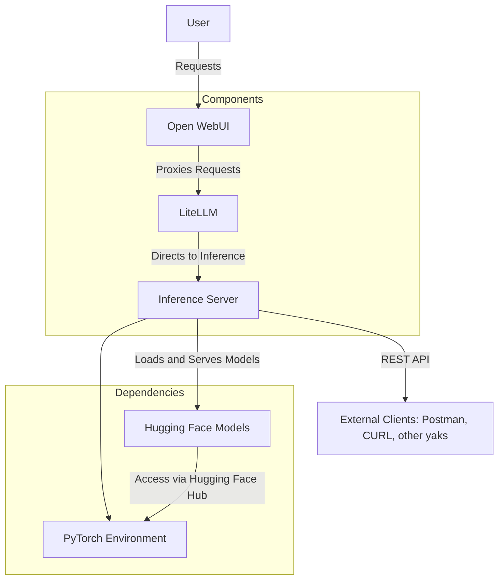

# yakbox 🐂

A lightweight server for hosting Hugging Face LLM models locally. **yakbox** 🐂 supports both Docker-based deployment and local installation, allowing flexibility for various use cases.

The project was created to leverage full Hugging Face transformer capabilities (pytorch) with Open WebUI, and at the same time a base to normalize token output via OpenAIs REST spec. The project is set up to take advantage of RTX GPUs.

## Flow


## Features ✨

- Serves Hugging Face models for inference.
- Serves [Open WebUI](https://github.com/open-webui/open-webui) for a chat experience with the inference server via [LiteLLM](https://github.com/BerriAI/litellm) proxy.
- Token streaming response via the completion endpoint!
- Once set up, simple `docker compose up -d` starts up the whole stack.

Essentially, this creates a completely localized chat experience with models pulled from Hugging Face, using the model's native pytorch capabilities to stream tokens back via rest endpoints.

## Prerequisites ⚙️

### For Local Installation

1. **HF Account Access**: Create a [Hugging Face](https://huggingface.co/) account and access the default model used in the project (`mistralai/Mistral-7B-Instruct-v0.3`).
   - You can use any model you like, just update it in `config.ini`.
2. **Token Setup**: Set your Hugging Face token like `HF_TOKEN=your_huggingface_token` in your environment variables on your local machine.
3. **Python**: Version 3.8 or higher.
4. **CUDA Toolkit**: If using GPU acceleration, ensure CUDA is installed and compatible with your GPU.
    - Recommended: CUDA 11.7 or 12.7
    - Test CUDA with:
        `nvidia-smi`
5. **Pip**: Ensure `pip` is up to date:
    `python3 -m pip install --upgrade pip`

## Installation and Running 💾

There are **two ways** to run the server:
### Running Directly 🚀
        
1. **Install Dependencies**:
    `pip install -r requirements.txt`
2. **Update `docker-compose.yml`**: If you're running the server locally, comment out the `server_slim` service in the `docker-compose.yml` file to avoid Docker attempting to spin up the server. 
3. **Run the Server**:
    `uvicorn yakbox:app --host 0.0.0.0 --port 8000`
      
### Running with Docker 📦

1. **Build and Start the Container**: `docker-compose up --build`   

Once the server is up, hit it with a request:
```
curl --location 'http://localhost:8000/chat/completions' \
--header 'Content-Type: application/json' \
--data '{
  "model": "",
  "messages": [
    {
      "role": "user",
      "content": "Provide a recipe for an Old Fashioned."
    }
  ],
  "stream": false
}'
```

## Open WebUI Integration 🔗
1. Navigate to http://localhost:3000/ (or whatever port openwebui is running on in docker).
2. Create an account (this persists locally, it does not register anywhere!).
3. Navigate to [Admin Panel >> Settings](http://localhost:3000/admin/settings) and click the Connections tab.
4. Update the OpenAI API field to http://litellm:4000/v1 with apikey `123` (by default it doesn't matter).
   - This allows Open WebUI to talk with LiteLLM, which is the proxy to the inference server. Make sure the ports match!
5. Turn off Ollama API.
6. Nav back to a **New Chat** and **Select a model** - an entry called `local-deploy` should appear, so select it.
7. Send a message and hope that it works!

## Configuration 🛠️

The server is configured through the `config.ini` file:

- **Model**: Define the Hugging Face model to use.
- **Device**: Use GPU (`cuda`) or CPU (`cpu`).
- **Parameters**: Adjust token limits, temperature, and other generation parameters.

It's a start - there are likely dozens of other configs to add here (quant settings).

## Troubleshooting ❓
- Some models will just not work given how the code handles the transformers as it is not very robust. `mistralai`, `microsoft`, `meta`, `qwen`, and a few others have worked with zero code changes - your mileage may vary.
- The Open WebUI connectivity is involved - please reference errors in Docker as they are pretty verbose and helpful.
- Many endpoints like multimodal support are not implemented. Again, basic project, feel free to fork and modify.
- Conversation management isn't great in the yak server, so models will sometimes go off the rail - you'll need to tweak Open WebUI or implement a better prompt for managing few shot examples and such.

## Licenses of Dependencies

Shoutouts to [Open WebUI](https://docs.openwebui.com/) and [LiteLLM](https://docs.litellm.ai/docs/proxy/deploy) for their awesome work!

This project uses the following libraries under their respective licenses:
- Hugging Face Transformers: [Apache 2.0](https://github.com/huggingface/transformers/blob/main/LICENSE)
- PyTorch: [BSD 3-Clause](https://github.com/pytorch/pytorch/blob/master/LICENSE)
- FastAPI: [MIT](https://github.com/tiangolo/fastapi/blob/master/LICENSE)
- Uvicorn: [BSD 3-Clause](https://github.com/encode/uvicorn/blob/master/LICENSE)
- SentencePiece: [Apache 2.0](https://github.com/google/sentencepiece/blob/master/LICENSE)
- Protobuf: [BSD 3-Clause](https://github.com/protocolbuffers/protobuf/blob/main/LICENSE)
- BitsAndBytes: [MIT](https://github.com/TimDettmers/bitsandbytes/blob/main/LICENSE)
- LiteLLM: [MIT](https://github.com/berriai/litellm/blob/main/LICENSE)
